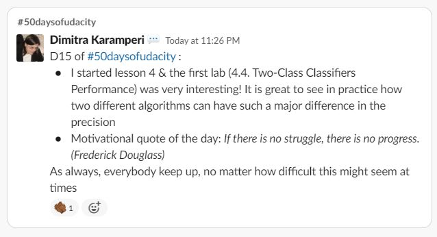
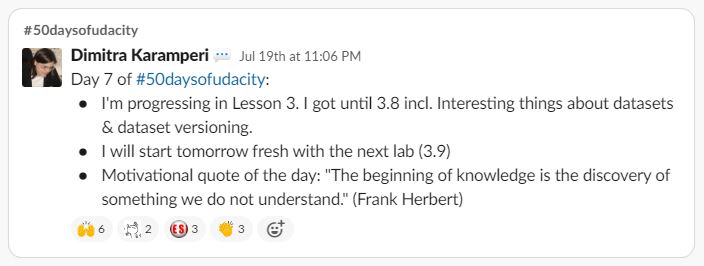

# #50DaysOfUdacity

A simple file to keep track of my progress & posts in the `#50daysofudacity` Slack channel, after my acceptance to the Microsoft Azure Machine Learning Scholarship by Microsoft.

___

### **What is the #50DaysOfUdacity challenge**

The premise of the challenge is to build a habit of consistent practice of new skills by making a public commitment of practicing the topics of the Foundation Course every day for 50 days!

In order to take part in this challenge, I have to:

- **[x] Take the public pledge** *--> Done*

- **[ ] Code or practice the topics of the Foundation Course for 30 minutes everyday.** *--> In progress*

- **[ ] Post a short announcement in the  `#50daysofudacity` Slack channel, summarizing my day and note which day I am on.** *--> In progress*

- **[ ] Encourage &  Support at least 2 peers every day.** *--> In progress*

The goal of this page is to track down the above so that I follow my progress easily and make sure not to miss a post, i.e. create my sort of **Captain's Log Book**!

*Photo taken from: https://bostonraremaps.com/inventory/frederick-livington-campbell-log-book/*

___

* For the motivational quote of the day, I built my own quote generator machine. You can try it here: https://dimikara.github.io/Quote-Generator.

___
___

## **Milestones**

| Milestone | Day | Achieved |
| :---: | :---: | :---: |
| 1st | 10  | [ x ] |
| 2nd | 25 | [ ] |
| 3rd | 40 | [ ] |
| 4th | 50 | [ ] |

___
___

## **Day 17:** 

*Wednesday, July 29th, 2020*

___

## **Day 16:** 

*Tuesday, July 28th, 2020*

___

## **Day 15:** 

*Monday, July 27th, 2020*

___

## **Day 14:** 

*Sunday, July 26th, 2020*

___

## **Day 13:** 

*Saturday, July 25th, 2020*

___

## **Day 12:** 

*Friday, July 24th, 2020*

___

## **Day 11:** 

*Thursday, July 23rd, 2020*

___

## **Day 10:** 

*Wednesday, July 22nd, 2020*

___

## **Day 9:** 

*Tuesday, July 21st, 2020*

___

## **Day 8:** 

*Monday, July 20th, 2020*

___

## **Day 7:** 

*Sunday, July 19th, 2020*

___

## **Day 6:** 

*Saturday, July 18th, 2020*

___

## **Days 1-5:** 

*Monday, July 13th, 2020* until *Friday, July 17th, 2020*

My posts for days 1-5 are no longer accessible in Slack, as the workspace has a limit of 10,000 messages.
I no longer remember details but during these first five days I had my first contact with the Azure environment and finished the first two lessons and the labs.

