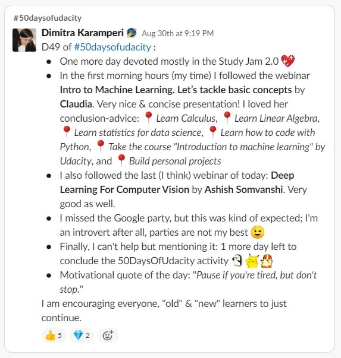
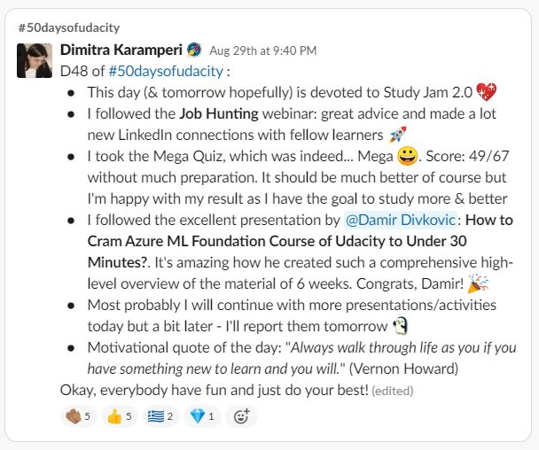
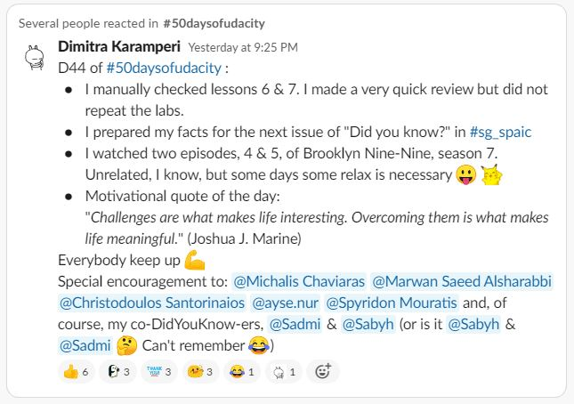
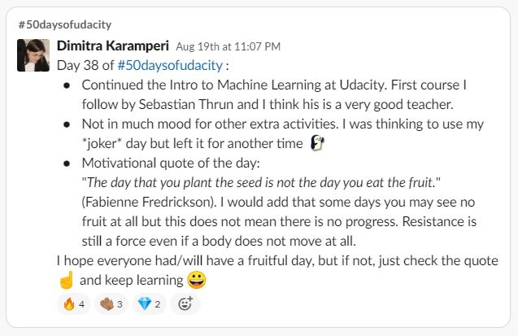
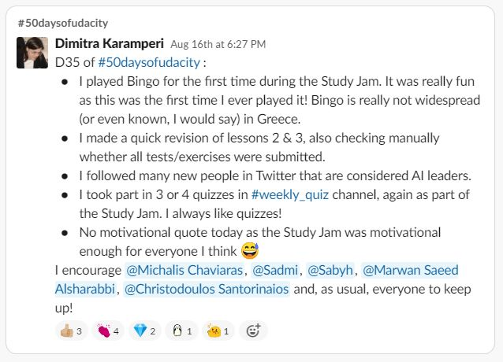
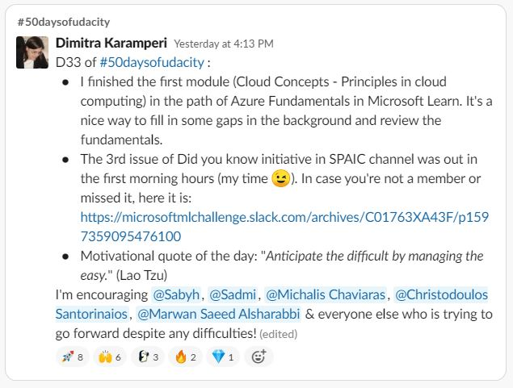
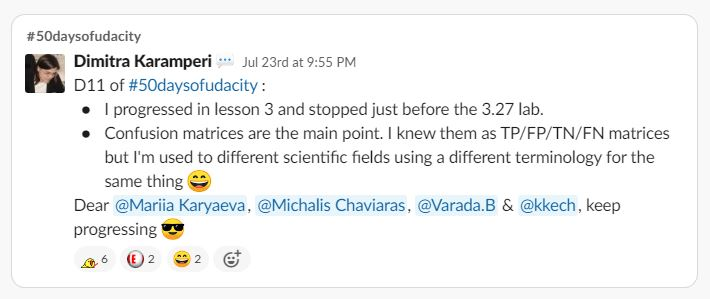

# UPDATE: #50DaysOfUdacity - The adventure continues

After the extension given for the course (30th of September, instead of the 10th), I will continue to post to in the challenge, including a new one as well: #26daysofconcepts.

Twenty-six days for the 26 letters of the English alphabet, each with important terms taken from the scholarship course or the field of Machine Learning in general.

___

## **Day 54 & 4/26:** 

*Monday, September 7th, 2020*

___

## **Day 53 & 3/26:** 

*Sunday, September 6th, 2020*

___

## **Day 52 & 2/26:** 

*Saturday, September 5th, 2020*

___

## **Day 51 & 1/26:** 

*Friday, September 4th, 2020*

___

# #50DaysOfUdacity

A simple file to keep track of my progress & posts in the `#50daysofudacity` Slack channel, after my acceptance to the Microsoft Azure Machine Learning Scholarship by Microsoft.

___

### **What is the #50DaysOfUdacity challenge**

The premise of the challenge is to build a habit of consistent practice of new skills by making a public commitment of practicing the topics of the Foundation Course every day for 50 days!

In order to take part in this challenge, I have to:

- **[ x ] Take the public pledge** *--> Done!*

- **[ x ] Code or practice the topics of the Foundation Course for 30 minutes everyday.** *--> Done!*

- **[ x ] Post a short announcement in the  `#50daysofudacity` Slack channel, summarizing my day and note which day I am on.** *--> Done!*

- **[ x ] Encourage &  Support at least 2 peers every day.** *--> Done!*

The goal of this page is to track down the above so that I follow my progress easily and make sure not to miss a post, i.e. create my sort of **Captain's Log Book**!

*Photo taken from: https://bostonraremaps.com/inventory/frederick-livington-campbell-log-book/*

___

* For the motivational quote of the day, I built my own quote machine. Get your motivational quote here: https://dimikara.github.io/Quote-Generator.

___
___

## **Finish Line**

___
___

## **Milestones**

| Milestone | Day | Achieved |
| :---: | :---: | :---: |
| 1st | 10  | [ x ] |
| 2nd | 25 | [ x ] |
| 3rd | 40 | [ x ] |
| End of challenge!!! | 50 | [ x ] |

___
___

## **Day 50:** 

*Monday, August 31st, 2020*

___

## **Day 49:** 

*Sunday, August 30th, 2020*

___

## **Day 48:** 

*Saturday, August 29th, 2020*

___

## **Day 47:** 

*Friday, August 28th, 2020*

___

## **Day 46:** 

*Thursday, August 27th, 2020*

___

## **Day 45:** 

*Wednesday, August 26th, 2020*

___
## **Day 44:** 

*Tuesday, August 25th, 2020*

___

## **Day 43:** 

*Monday, August 24th, 2020*

___

## **Day 42:** 

*Sunday, August 23rd, 2020*

___

## **Day 41:** 

*Saturday, August 22nd, 2020*

___

## **Day 40:** 

*Friday, August 21st, 2020*

___

## **Day 39:** 

*Thursday, August 20th, 2020*

___

## **Day 38:** 

*Wednesday, August 19th, 2020*

___

## **Day 37:** 

*Tuesday, August 18th, 2020*

___

## **Day 36:** 

*Monday, August 17th, 2020*

___

## **Day 35:** 

*Sunday, August 16th, 2020*

___

## **Day 34:** 

*Saturday, August 15th, 2020*

___

## **Day 33:** 

*Friday, August 14th, 2020*

___

## **Day 32:** 

*Thursday, August 13th, 2020*

___

## **Day 31:** 

*Wednesday, August 12th, 2020*

___

## **Day 30:** 

*Tuesday, August 11th, 2020*

___

## **Day 29:** 

*Monday, August 10th, 2020*

___

## **Day 28:** 

*Sunday, August 9th, 2020*

___

## **Day 27:** 

*Saturday, August 8th, 2020*

___

## **Day 26:** 

*Friday, August 7th, 2020*

___

## **Day 25:** 

*Thursday, August 6th, 2020*

___

## **Day 24:** 

*Wednesday, August 5th, 2020*

___

## **Day 23:** 

*Tuesday, August 4th, 2020*

___

## **Day 22:** 

*Monday, August 3rd, 2020*

___

## **Day 21:** 

*Sunday, August 2nd, 2020*

___

## **Day 20:** 

*Saturday, August 1st, 2020*

___

## **Day 19:** 

*Friday, July 31st, 2020*

___

## **Day 18:** 

*Thursday, July 30th, 2020*

___

## **Day 17:** 

*Wednesday, July 29th, 2020*

___

## **Day 16:** 

*Tuesday, July 28th, 2020*

___

## **Day 15:** 

*Monday, July 27th, 2020*

___

## **Day 14:** 

*Sunday, July 26th, 2020*

___

## **Day 13:** 

*Saturday, July 25th, 2020*

___

## **Day 12:** 

*Friday, July 24th, 2020*

___

## **Day 11:** 

*Thursday, July 23rd, 2020*

___

## **Day 10:** 

*Wednesday, July 22nd, 2020*

___

## **Day 9:** 

*Tuesday, July 21st, 2020*

___

## **Day 8:** 

*Monday, July 20th, 2020*

___

## **Day 7:** 

*Sunday, July 19th, 2020*

___

## **Day 6:** 

*Saturday, July 18th, 2020*

___

## **Days 1-5:** 

*Monday, July 13th, 2020* until *Friday, July 17th, 2020*

My posts for days 1-5 are no longer accessible in Slack, as the workspace has a limit of 10,000 messages.
I no longer remember details but during these first five days I had my first contact with the Azure environment and finished the first two lessons and the labs.

